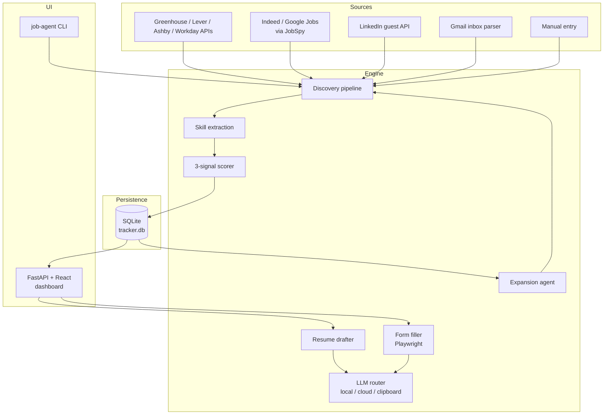
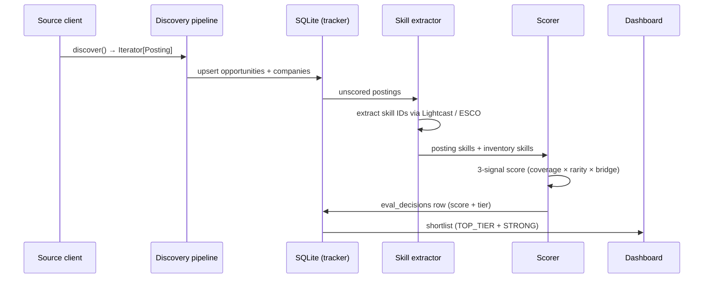
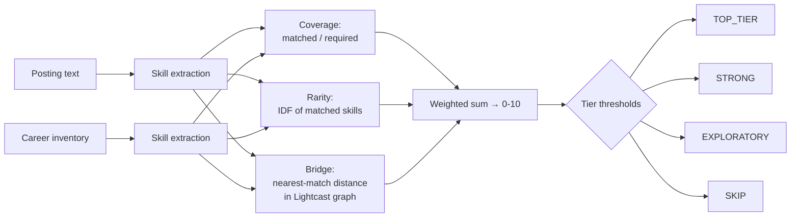
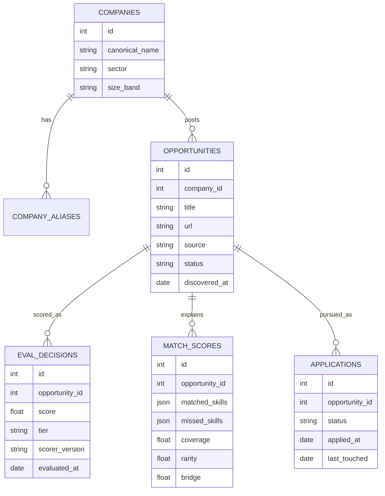
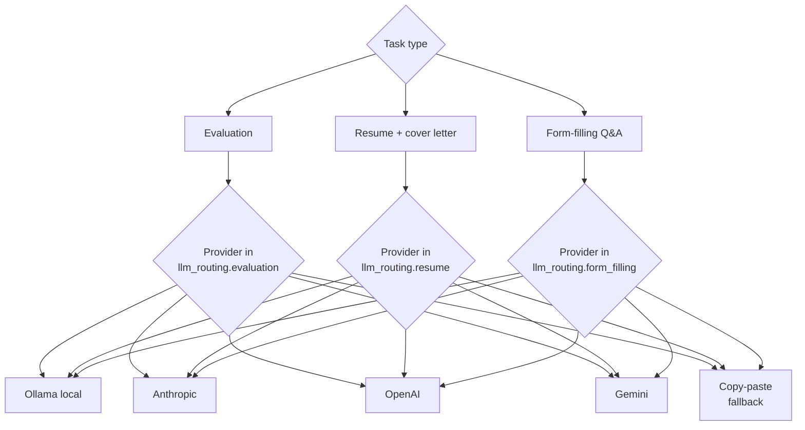

# Architecture

A diagram-first tour of how Job Agent is wired together.

## System overview



A Python monorepo, one SQLite DB per user profile, no external services required. Each layer is independently testable and the discovery sources are isolated — one failing source never blocks the pipeline.

## Data flow



Each step is idempotent. The pipeline can resume mid-run by replaying from the last persisted state.

## Matching algorithm



**Coverage** — fraction of posting skills present in the user's inventory. A baseline measure of fit.

**Rarity** — IDF-weighted matches. A skill that appears in 5 % of postings counts more than one in 80 %, so rare-skill alignment surfaces postings most other applicants can't match.

**Bridge** — for near-miss skills, the shortest path through the Lightcast taxonomy. "Power BI ↔ Tableau" is closer than "Power BI ↔ Welding"; bridge scoring credits the former.

Final score is a weighted sum (calibratable). Tier thresholds are stored in `default.yaml` and edited by the Calibration tab via guided yes/no on sample postings.

## Database schema



Schema is versioned. Migrations under `data/schemas/v2_*/migration.sql` apply in order on `Tracker.__init__`; fresh DBs jump straight to the latest version.

## LLM routing



Each task picks its own provider, configured per profile in `llm_routing`. A fallback chain handles transient failures: rate limits and timeouts retry-then-fall-through; auth errors fall through immediately; the chain always terminates in the unbreakable copy-paste prompt path.

## Directory layout

```
job-agent/
├── jobagent/                   CLI, scheduler, services, platform-detect
├── engine/
│   ├── discovery/              source clients (ATS, JobSpy, LinkedIn, Gmail)
│   ├── matching/               scorer, calibrator
│   ├── applicant/              form filler, worksheet, CAPTCHA, multistep
│   ├── resume/                 prompt generator, LLM router, cost estimator
│   ├── expansion/              weekly title-cluster + employer-deep + gap analyzer
│   ├── digest/                 daily-digest builder
│   ├── expiry/                 404 sweep + dismiss
│   ├── llm/                    fallback chain
│   ├── profiles/               profile + domain loader
│   └── persistence/            Tracker (SQLite) + schema migrations
├── dashboard/
│   ├── backend/                FastAPI routes
│   └── frontend/               React + Vite + Tailwind
├── config/
│   ├── profiles/               per-profile YAML (gitignored except .example)
│   └── domains/                role-type vocabularies (gitignored except .example)
├── source_materials/           per-profile inventory + resumes (gitignored)
├── data/                       per-profile SQLite + run history (gitignored)
└── tests/                      pytest suite (1,500+ tests)
```

## Adding things

| You want to add… | Read |
|------------------|------|
| A new source | ARCHITECTURE.md → Discovery section + `engine/discovery/` examples |
| A new ATS handler | `engine/applicant/handlers/` + `BaseHandler` subclass + URL pattern in `base.py` |
| A new LLM provider | `engine/resume/router.py` + `cost_estimator.py` + setup-wizard tester |
| A new dashboard tab | `dashboard/backend/routes/` + `dashboard/frontend/src/tabs/` |

See [CONTRIBUTING.md](CONTRIBUTING.md) for the PR workflow.
