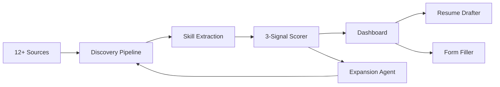

<div align="center">
  <h1>🎯 Job Agent</h1>
  <p><strong>Local-first AI job search agent that does the boring parts so you can focus on interviewing.</strong></p>

  <p>
    
    
    
    
  </p>
</div>

```
┌─────────────────────────────────────────────────────────┐
│  📊 Dashboard    Today: 12 new · 3 top-tier · 1 applied │
│─────────────────────────────────────────────────────────│
│  🏢 Acme Corp — Senior PM         ████████░░ 8.2        │
│  🏢 TechCo — Delivery Lead        ███████░░░ 7.1        │
│  🏢 FinGroup — Program Manager    ██████░░░░ 6.4        │
│─────────────────────────────────────────────────────────│
│  [Select] [Skip] [Why this score?] [Draft resume]       │
└─────────────────────────────────────────────────────────┘
```

## ✨ Features

| Feature | What it does |
|---------|-------------|
| 🔍 **12+ source discovery** | Greenhouse, Lever, Ashby, Workday, Indeed, LinkedIn, Gmail inbox — one pipeline |
| 📊 **3-signal scoring** | Coverage × rarity × bridge proximity. Every score is explainable, not a black box |
| 📝 **Resume + cover letter drafts** | Per-posting prompts routed to Claude, GPT, Gemini, Ollama, or your clipboard |
| 🤖 **Form filler** | Playwright walks ATS forms field by field. You review. You click submit |
| 📈 **Expansion agent** | Learns which titles and employers score well. Suggests new searches weekly |
| ⚙️ **Calibratable** | Tune scoring thresholds until the shortlist matches YOUR judgment |
| 🔒 **Your data stays local** | SQLite on your disk. Cloud LLMs are optional. No account required |

## 🚀 Quick Start

```bash
pip install -e .
job-agent start
```

Browser opens → setup wizard (8 steps, ~20 min) → first discovery run → dashboard.

Detailed walkthrough in [QUICKSTART.md](QUICKSTART.md).

## 💡 Why Job Agent?

Job searching is repetitive grunt work. You check the same 10 sites, read the same irrelevant postings, copy-paste the same resume into slightly different ATS forms. Job Agent automates that grunt work — discovery, scoring, drafting — so you spend time on the parts that actually matter: preparing for interviews and choosing where to work. It runs on your laptop, scores against YOUR career inventory (not keyword matching), and never auto-submits anything. You're always the one who clicks the final button.

## 🏗️ Architecture



## 🛠️ Tech Stack

| Layer | Tech |
|-------|------|
| Backend | Python 3.12, FastAPI, SQLite |
| Frontend | React, Vite, Tailwind, shadcn/ui |
| LLM | Ollama (local) or Claude / GPT / Gemini (cloud) |
| Browser automation | Playwright |
| Skill taxonomy | Lightcast + ESCO via ojd-daps-skills |

## 📚 Documentation

| Doc | What's inside |
|-----|--------------|
| [QUICKSTART.md](QUICKSTART.md) | Zero to first scored results in 30 min |
| [CONFIGURATION.md](CONFIGURATION.md) | Every config file explained |
| [ARCHITECTURE.md](ARCHITECTURE.md) | System design, data flow, matching algorithm |
| [CONTRIBUTING.md](CONTRIBUTING.md) | How to add sources, fix bugs, submit PRs |
| [TROUBLESHOOTING.md](TROUBLESHOOTING.md) | Common issues + fixes |

## 🗺️ Roadmap

- [x] Multi-source discovery (12+ ATS integrations)
- [x] 3-signal skill-based scoring
- [x] Browser-based setup wizard
- [x] Resume + cover letter prompt generation
- [x] Playwright form filler
- [x] Weekly expansion agent
- [x] Calibratable scoring thresholds
- [x] Dashboard with pipeline tracker
- [ ] PDF resume export
- [ ] Multi-language support
- [ ] Docker one-liner install

## 📄 License

[Sustainable Use License](LICENSE) — use freely for personal or internal-business purposes. Not for commercial resale or white-labeling.
